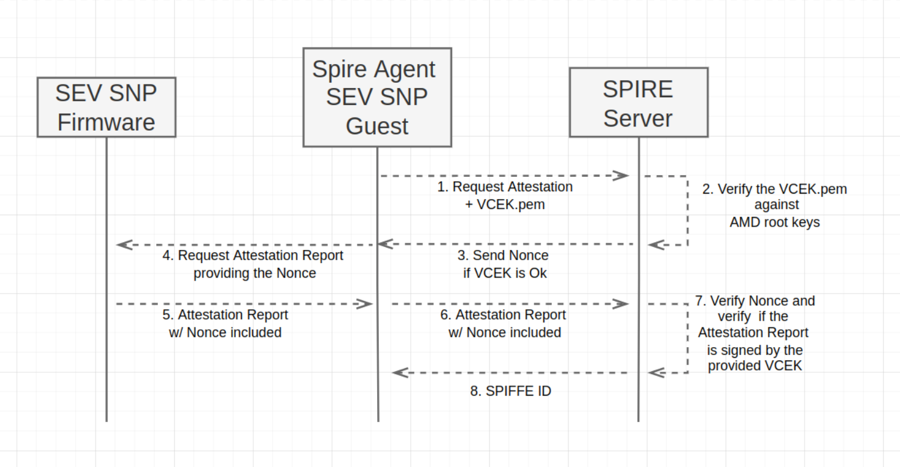

# AMD SEV SNP SPIRE Plugin

An AMD SEV-SNP Node attestation plugin for SPIRE Server and SPIRE Agent.

## 1. How it works.

The plugin consists of an attestation of an Agent, based on the guest report obtained by an ATTESTATION_REPORT command to the SEV-SNP firmware. The sequence diagram presented below depicts the workflow.



First, the Agent sends the chip VCEK to the Server so it can verify its authenticity using the AMD Root chain.

Once it is verified, the Server provides a Nonce to the Agent, which must be included in the attestation report.

The Agent requests from AMD SEV-SNP firmware an attestation report and provides the Nonce sent by the Server to it; after obtaining the report, the Agent sends it to the Server.

Then, the Server verifies that the report was signed by the private key of the VCEK, and verifies whether the Nonce included in the report is correct. If both verifications succeed, the Server provides the SPIFFE ID to the Agent following the template:

`spiffe://{{trust_domain}}/spire/agent/{{plugin_name}}/{{uuid}}/measurement/{{measurement}}/policy/{{policy}}`

The info about `measurement` and `policy` are included in the report 

## 2. Dependencies.

* A Virtual Machine with Ubuntu operating system and SEV-SNP enabled;
* A valid [GoLang](https://go.dev/doc/install) installation;

## 3. Running the plugin.

The following steps describe how to configure the plugin to run in an environment with Ubuntu 20.04, and the SPIRE Agent and SPIRE Server running on the same machine, that is a AMD SEV-SNP enabled guest VM. You can see how to run a guest with ubuntu 20.04 and SEV-SNP enabled [here](https://git.lsd.ufcg.edu.br/securedsp/AMDSEV). Notice that you may have to do some changes to run in other environments depending on the configs of it.

### 3.1 Setting up environment.

First of all, let's update and upgrade the packages of your OS to guarantee that everything is up-to-date.

```sh
sudo apt update -y
sudo apt install build-essential -y
sudo apt upgrade -y
```

Now, let's clone the SPIRE Project repo and build it:

```sh
# Clone the repository and go to the folder
git clone https://github.com/spiffe/spire
cd spire/

# Build the server and agent cli applications
go build ./cmd/spire-server
go build ./cmd/spire-agent

# Copy the binaries to /usr/bin so you can have
# access to 'spire-server' and 'spire-agent' commands
sudo cp -r ./spire-server /usr/bin/
sudo cp -r ./spire-agent /usr/bin/
```

To test the installation, run:

```sh
spire-server --version
# 1.4.3-dev-unk
spire-agent --version
# 1.4.3-dev-unk
```

now, you can copy the `conf` file inside SPIRE repository to `/home/$USER`.

```
cp -r conf/ ~/
cd ~/
```

### 3.2 Building the plugin.

Now let's clone the plugin repository.

```sh
git clone https://git.lsd.ufcg.edu.br/securedsp/amd-sev-snp-plugin.git
cd amd-sev-snp-plugin/
```

build the agent and the server plugin.

```sh
make build BUILD_PATH=<PATH_TO_BUILD>

# It will generate a <PATH_TO_BUILD>/snp-agent and <PATH_TO_BUILD>/snp-server binaries, 
# which is the agent and server plugin binary respectively
#  To simplify, you can set "~/" as the build path.
```

## 4. How to configure the Agent and Server files.

First, replace the files you have copied to `/home/$USER/conf/agent/agent.conf` and `/home/$USER/conf/server/server.conf` with the `agent.conf` and `server.conf` files of this repository.

```sh
mv agent.conf ~/conf/agent/agent.conf
mv server.conf ~/conf/server/server.conf
cd ~/
```

### 4.1 Spire Agent configuration file.

The **plugin_cmd** configs in the NodeAttestor **sev-snp** are not set in `~/conf/agent/agent.conf`, you must replace the **plugin_cmd** with the path of the agent sev-snp plugin binary that you have built. 

```conf
# agent.conf
NodeAttestor "sev_snp" {
        plugin_cmd = "<path_to_plugin_binary>"
        plugin_checksum = ""
        plugin_data {
	        vcek_path = "<path/to/vcek>"
        }
}
```

To obtain the VCEK, you can use the `export_cert_chain_vcek` command of [sev-tool](https://github.com/AMDESE/sev-tool) to get it from the Host machine and then import it into the Guest VM.

*if you followed the instructions, the path is `/home/$USER/snp-agent`. (notice that you have to replace $USER with your username, env variables are not allowed in the config file)*

### 4.2 Spire Server configuration file.

The **plugin_cmd** configs in the NodeAttestor **sev-snp** are not set in `~/conf/server/server.conf`, you must replace the **plugin_cmd** with the path of the server sev-snp plugin binary that you have built. 

```conf
# server.conf
NodeAttestor "sev_snp" {
    plugin_cmd = "<path_to_plugin_binary>"
    plugin_checksum = ""
    plugin_data {
        amd_cert_chain = "<path/to/amd_certchain>"
    }
}
```

You can find how to download the cert chain for your AMD secure processor following [this docs](https://www.amd.com/system/files/TechDocs/57230.pdf).

*if you followed the instructions, the path is `/home/$USER/snp-server`. (notice that you have to replace $USER with your username, env variables are not allowed in the config file)*

## 5. Running SPIRE with the plugin.

Now that you have configured everything, you can run the SPIRE Server and the SPIRE Agent.

```sh
cd ~/

spire-server run -config conf/server/server.conf

spire-agent run -config conf/agent/agent.conf
```

Depending on your configuration, you must expect that the Agent has been successfully attested or not.

## 6. References

* [Spire SDK for plugin creation](https://github.com/spiffe/spire-plugin-sdk)
* [Spire quickstart for Linux](https://spiffe.io/docs/latest/try/getting-started-linux-macos-x/)
