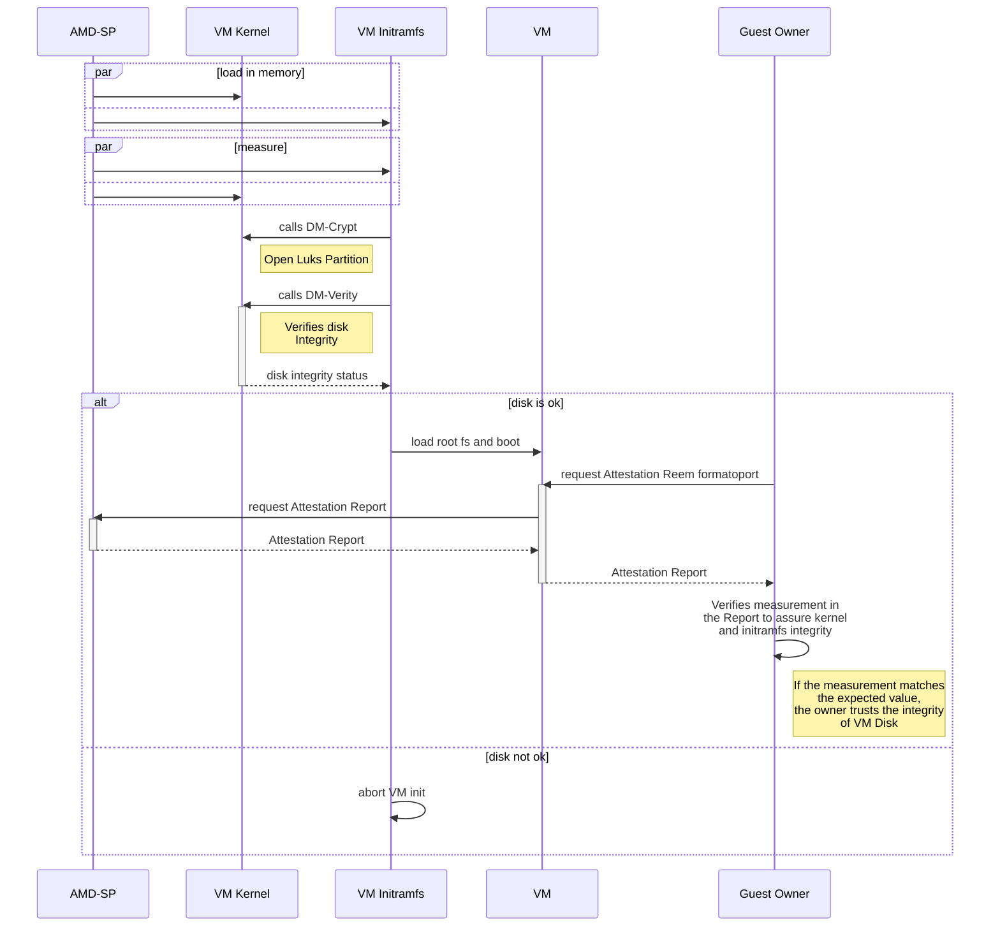
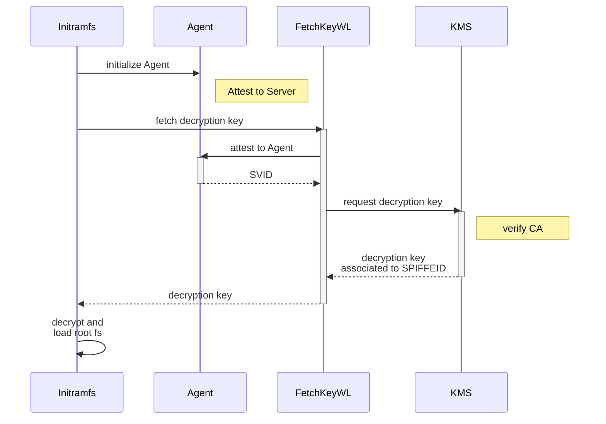
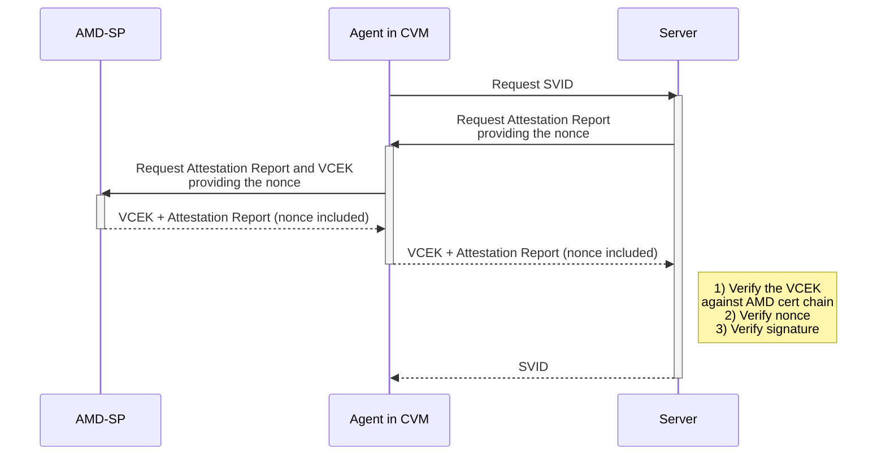

# RFC - SEV SNP Node Attestation Plugin

**Warning:** This RFC is being kept the same as published to the community (https://github.com/spiffe/spire/issues/4469). The improvements made to the plugin since that date are not reflected in this document but are reflected in other documentation of this repo.

## Abstract

This document defines the AMD Secure Encrypted Virtualization-Secure Nested Paging (SEV-SNP) Node Attestation Plugin for SPIRE. The plugin provides a mechanism for verifying the identity of SEV-SNP-enabled Virtual Machines (VMs) by leveraging the hardware-based attestation capabilities of the AMD SEV-SNP processor. The document provides detailed specifications for the plugin, including its workflow, threat model, and description of its chain of trust. It also describes the security considerations and deployment scenarios for the plugin.

## Background

### AMD SEV-SNP

AMD SEV-SNP (Secure Encrypted Virtualization-Scalable Nested Paging) is a set of hardware-based security features designed to enhance the security of virtualized environments [[4](https://www.amd.com/system/files/TechDocs/SEV-SNP-strengthening-vm-isolation-with-integrity-protection-and-more.pdf)]. It extends both the AMD Secure Encrypted Virtualization (SEV) technology, which provides hardware-based memory encryption for VMs to isolate them from the hypervisor [[1](https://developer.amd.com/sev/)], and SEV-Encrypted State (SEV-ES), which adds additional protection for CPU register state as an extension of SEV [[3](https://www.amd.com/system/files/TechDocs/Protecting%20VM%20Register%20State%20with%20SEV-ES.pdf)].

The main difference between AMD SEV/SEV-ES and AMD SEV-SNP is the strong memory integrity protection present on SEV-SNP that helps prevent malicious hypervisor-based attacks, such as data replay and memory re-mapping. The fundamental concept behind SEV-SNP integrity is that whenever a VM accesses an encrypted memory page, it must retrieve the value it previously wrote. If it reads a different value, an exception must be thrown [[4](https://www.amd.com/system/files/TechDocs/SEV-SNP-strengthening-vm-isolation-with-integrity-protection-and-more.pdf)].

### Threat Model for AMD SEV-SNP Confidential VMs

The threat model for Confidential Computing assumes a highly powerful attacker with privileges to access and manipulate all software layers of the infrastructure, including the operating systems, hypervisors, and cloud computing platforms where confidential workloads are running. Regarding the host machine and its software stack, the attacker may be able to steal cryptographic keys and sensitive data, modify application code or binaries, and launch various types of attacks, such as side-channel attacks. [[4](https://www.amd.com/system/files/TechDocs/SEV-SNP-strengthening-vm-isolation-with-integrity-protection-and-more.pdf)]

Under SEV-SNP, as with SEV and SEV-ES, the AMD System-On-Chip (SoC) hardware, the AMD Secure Processor (AMD-SP), and the VM itself are all treated as fully trusted, while all other CPU software components, PCI devices, and operators of these are treated as entirely untrusted. This includes the BIOS on the host system, the hypervisor, device drivers, and other VMs. This means that these components are assumed to be malicious, potentially conspiring with other untrusted components to compromise the security guarantees of a SEV-SNP VM.


(Figure from [[4](https://www.amd.com/system/files/TechDocs/SEV-SNP-strengthening-vm-isolation-with-integrity-protection-and-more.pdf)])

To enable third parties to have confidence in the VM's state, the SEV-SNP provides a mechanism to attest integrity of the VM's and its environment (confirming it is indeed a AMD SEV-SNP VM). This is done by generating an Attestation Report that reflects the VM's context, including policy information and measurements taken by the AMD-SP during launch. Through measurement hashes in the Attestation Reports, third parties can verify, for example, if the VM has been launched with the expected state (e.g., a specific version of Linux Kernel, the expected Initramfs that includes disk integrity mechanisms). In addition, other information in the Attestation Report reflect other configuration options, for example, if this VM is allowed to run in debug mode. These Attestation Reports are described next.

### Chain of Trust

To build a chain of trust between the AMD-SP and the guest VM that remote parties can validate, the AMD-SP provides a protected path through which the guest VM can request Attestation Reports on their behalf at any time. When the guest asks for a report, it supplies 512 bits of arbitrary data to be included in the report. The resulting report will contain this data alongside identity information about the guest and the host where it is running. The report can be signed by a Versioned Chip Endorsement Key (VCEK), an attestation signing key derived from chip-unique secrets, and a TCB (Trusted Computing Base) version, signed by the AMD Root Keys and kept inside the AMD-SP with no access by users. The report may also be signed by a Versioned Loaded Endorsement Key (VLEK), derived from a seed maintained by the AMD Key Derivation Service (KSD) [[5](https://www.amd.com/system/files/TechDocs/56860.pdf)]. The third-party should verify the authenticity of the report based on its signature. A successfull signature verification proves that the 512 bits of guest data supplied in the report came from the guest whose identity is described.

### Attestation Report

The purpose of the Attestation Report is to allow the VM to prove to third parties that it is confidential and has been configured in a trustable state with no tampering. The following table describes the Attestation Report structure [[5](https://www.amd.com/system/files/TechDocs/56860.pdf)]:

| Name              | Description                  |
|-------------------|------------------------------|
| POLICY          | The guest policy ([see below](#policy))                                                                                                                  |
| MEASUREMENT     | The measurement calculated at launch ([see below](#launch-measurement))                                                                                              |
| REPORT_DATA       | Guest-provided data                                                                                                                 |
| VERSION           | Version number of the Attestation Report (set to 0x02 for [this](https://www.amd.com/system/files/TechDocs/56860.pdf) specification) |
| GUEST_SVN         | The guest Secure Version Number (SVN)                                                                                               |
| FAMILY_ID         | The family ID provided at launch                                                                                                    |
| IMAGE_ID          | The image ID provided at launch                                                                                                     |
| VMPL              | The request Virtual Machine Privilege Level (VMPL) for the Attestation Report                                                       |
| SIGNATURE_ALGO    | The signature algorithm used to sign the report                                                       |
| CURRENT_TCB       | Current TCB ([see below](#tcb-version))                                                                                                                        |
| PLATFORM_INFO     | Information about the platform (indicates if TSME or SMT are enabled in the system)                                                 |
| SIGNING_KEY       | Encodes the key used to sign the report (0: VCEK, 1: VLEK, 2–6: Reserved, 7: None)                                                   |
| MASK_CHIP_KEY     | The value of MaskChipKey                                                                                                            |
| AUTHOR_KEY_EN     | Indicates that the digest of the author key is present in AUTHOR_KEY_DIGEST (set to the value of GCTX.AuthorKeyEn)                   |
| HOST_DATA         | Data provided by the hypervisor at launch                                                                                           |
| ID_KEY_DIGEST     | SHA-384 digest of the ID public key that signed the ID block provided in SNP_LAUNCH_FINISH                                          |
| AUTHOR_KEY_DIGEST | SHA-384 digest of the Author public key that certified the ID key, if provided in SNP_LAUNCH_FINISH (zeros if AUTHOR_KEY_EN is 1)   |
| REPORT_ID         | Report ID of the guest                                                                                                              |
| REPORT_ID_MA      | Report ID of the guest’s migration agent                                                                                            |
| REPORTED_TCB      | Reported TCB version used to derive the VCEK that signed this report                                                                |
| CHIP_ID           | If MaskChipId is set to 0, identifier unique to the chip as output by GET_ID, otherwise, set to 0                                   |
| COMMITTED_TCB     | Committed TCB                                                                                                                       |
| CURRENT_BUILD     | The build number of CurrentVersion                                                                                                  |
| CURRENT_MINOR     | The minor number of CurrentVersion                                                                                                  |
| CURRENT_MAJOR     | The major number of CurrentVersion                                                                                                  |
| COMMITTED_BUILD   | The build number of CommittedVersion                                                                                                |
| COMMITTED_MINOR   | The minor version of CommittedVersion                                                                                               |
| COMMITTED_MAJOR   | The major version of CommittedVersion                                                                                               |
| LAUNCH_TCB        | The Current TCB at the time the guest was launched or imported                                                                      |
| SIGNATURE         | Signature of bytes 0x000 to 0x29F (inclusive) of this report                                                                          |

The Attestation Report is signed by the private part of the VCEK/VLEK, which is located inside the AMD-SP. The public part of the VCEK/VLEK can be used to verify the signature, and its authenticity can be verified against the AMD Certificate Chain to ensure that it is valid. Therefore, we can guarantee that the report was generated inside an AMD-SP, as it is the only entity with access to the VCEK/VLEK private part.

Moreover, the user can include 512 bits of data in the Attestation Report, which ensures its freshness. By doing this, we can trust that (1) the Attestation Reports given by a VM have been freshly generated in response to the current request, and (2) the report was generated by an authentic AMD-SP (due to its signature).

### Platform Info

The platform info structure details configurations about the platform. It is structured as follows.

| Bit(s) | Name      | Description  |
|--------|-----------|--------------|
| 63:2   |     -     | Reserved |
| 1      | TSME_EN   | Indicates that Transparent Secure Memory Encryption (TSME) is enabled in the system |
| 0      | SMT_EN    | Indicates that Simultaneous Multithreading (SMT) is enabled in the system |

### Policy

The policy parameters refer to the set of rules that govern the behavior of the VM, for example, if the VM allows or not debug mode or if it is allowed to run in a platform with Simultaneous Multithreading (SMT) enabled. In the Attestation Report, the policy field is represented as 64 bits of data and is structured as follows [[5](https://www.amd.com/system/files/TechDocs/56860.pdf)]:

| Bit(s) | Name            | Description                                                                                             |
|--------|-----------------|---------------------------------------------------------------------------------------------------------|
| 63:21  |        -        | Reserved, must be zero                                                                                 |
| 20     | `SINGLE_SOCKET` | 0: Guest can be activated on multiple sockets / 1: Guest can be activated only on single socket machines           |
| 19     | `DEBUG`         | 0: Debugging is disallowed / 1: Debugging is allowed                                                   |
| 18     | `MIGRATE_MA`    | 0: Association with a migration agent is disallowed / 1: Association with a migration agent is allowed |
| 17     |        -        | Reserved, must be zero                                                                                 |
| 16     | `SMT`           | 0: SMT is disallowed / 1: SMT is allowed                                                               |
| 15:8   | `ABI_MAJOR`     | The minimum ABI major version required for this guest to run                                           |
| 7:0    | `ABI_MINOR`     | The minimum ABI minor version required for this guest to run                                           |

### TCB Version

The TCB_VERSION is a structure containing the security version numbers of the components in the SNP firmware's trusted computing base (TCB). A TCB_VERSION is associated with each image of firmware. The TCB_VERSION structure is described below:

| Bit(s) | Name            | Description                                                                                             |
|--------|-----------------|---------------------------------------------------------------------------------------------------------|
| 63:56  |   `MICROCODE`   | Lowest current patch level of all cores |
| 55:48  | `SNP`           | Version of the SNP firmware <br/>Security Version Number (SVN) of SNP firmware |
| 47:16  | `-`             | Reserved                |
| 15:8   | `TEE`           | Current Platform Security Processor (PSP) OS version, SVN of PSP operating system |
| 7:0    | `BOOT_LOADER`   | Current bootloader version, SVN of PSP bootloader |

### Launch Measurement

The Attestation Report also contains a Launch Measurement of the guest, which is calculated as [[6](https://www.amd.com/system/files/TechDocs/56860.pdf)]:

```
HMAC(0x04 || API_MAJOR || API_MINOR || BUILD || GCTX.POLICY || GCTX.LD || MNONCE; GCTX.TIK)
```

Where "||" represents concatenation. GCTX represents the guest context and the GCTX.LD is a hash digest of all plaintext data imported into the guest at boot, and how this value is calculated depends on the hypervisor. For QEMU, it can be calculated as:

```
SHA256(firmware_blob || kernel_hashes_blob || vmsas_blob)
```

Where:

* `firmware_blob` is the content of the entire firmware flash file (for example, OVMF.fd). Note that you must build a stateless firmware file that does not use an NVRAM store because the NVRAM area is not measured, and therefore, using firmware that uses a state from an NVRAM store is not secure.

* If kernel is used, and _kernel-hashes=on_, then `kernel_hashes_blob` is the content of PaddedSevHashTable (including the zero padding), which itself includes the hashes of kernel, initrd, and cmdline that are passed to the guest. 

* If SEV-ES is enabled (_policy & 0x4 != 0_), `vmsas_blob` is the concatenation of all VMSAs of the guest vcpus. Each VMSA is 4096 bytes long; its content is defined inside Linux kernel code as struct vmcb_save_area, or in AMD APM Volume 2 ([APMVOL2](https://www.amd.com/system/files/TechDocs/24593.pdf)) Table B-2: VMCB Layout, State Save Area.

## Ensuring Node Integrity and Security

Although SEV-SNP guarantees guest memory encryption, it only encrypts data in use. To ensure data protection at rest, such as keys and secrets stored in the VM disk, a Full Disk Encryption (FDE) solution, such as Linux Unified Key Setup (LUKS), must be used. To guarantee data integrity at rest, an integrity verification tool such as DM-Verity must also be used. It is recommended to include these verifications in the Initramfs or kernel because they are measured in the Launch Measurement included in the Attestation Report so the VM owner can verify if the value matches with the expected, ensuring that everything has been performed correctly and that there has been no tampering neither in the kernel nor in Initramfs.

The sequence diagram presented next describes how a chain of trust between AMD-SP and the VM disk integrity is built through the Launch Measurement included in the Attestation Report. Although other components impact the chain of trust, in this scheme, we focus on the ones that directly affect the integrity of the VM Disk.



1. The kernel and the Initramfs are loaded in the memory of the VM.
2. The AMD-SP measures the kernel and the Initramfs.
3. When the Initramfs runs, it calls the module DM-Crypt of the kernel to open the encrypted partition.
4. The Initramfs calls DM-Verity kernel module to verify the disk integrity.
5. If the verification passes and the VM disk is ok, the VM starts; if not, the VM start halts.
6. After the VM is running, the Guest Owner can request Attestation Reports containing the measurement generated in step 1, which considers hashes of Initramfs and kernel.
7. After receiving the Attestation Report, the Guest Owner can verify if the measurement matches the expected value. If it matches, then the Guest Owner can trust the verification made by Initramfs using the kernel's DM-Verity module.

For step 3, we must retrieve the secret to open the encrypted partition. For this, we can use a Key Managment Service (KMS). For the proof of concept, we used a workload named Fetch Key Workload (FetchKeyWL) to retrieve the secret (the disk encryption key) based on the SPIFFE ID and the disk UUID.



## Proposal

We propose a new SPIRE Node Attestation Plugin that uses SEV-SNP features to attest SPIRE Agents running inside SEV-SNP-enabled VMs. The idea behind the plugin is to take advantage of the existing Attestation Report provided by the AMD-SP to guarantee the identity and integrity of the VM running the SPIRE Agent.

### Attestation Workflow



1. The SPIRE Agent inside the SEV-SNP Guest sends an attestation request.
2. The Server sends a nonce to the Agent, which should be included in the Attestation Report.
3. The Agent requests an extended Attestation Report from the AMD-SP, providing the nonce sent by the Server to be included in the report.
4. The AMD-SP generates an Attestation Report with the included nonce and sends it to the Agent along with the VCEK public certificate.
5. The Agent sends the Attestation Report and the VCEK public certificate to the Server.
6. The Server then verifies if the VCEK is valid by checking it against the AMD certificate chain.
7. The Server verifies if the nonce included in the Attestation Report is correct and checks if the private part of the VCEK signed the Report.
8. If the validations in step 7 were successfull, the SVID is provided to the Agent.

### Configuration

To run the plugin, the VCEK public certificate must be configured on the SEV-SNP host through the SNP_SET_EXT_CONFIG command. So the Guest can obtain it along with the attestation report through a SNP_GET_EXT_REPORT [[9](https://www.amd.com/content/dam/amd/en/documents/developer/lss-snp-attestation.pdf)]. In most cloud providers, this configuration is done by default on the hosts; in on-premise solutions, it can be done using the [sev-guest](https://github.com/AMDESE/sev-guest) tool.

A sample configuration for the SPIRE Agent would include the following configs for the node attestor:

```conf
    # agent.conf
    NodeAttestor "sev_snp" {
        plugin_data {}
    }
```

The server must then be configured with (or retrieve) the AMD certificate chain to verify the authenticity of the VCEK. The steps to obtain this cert chain can be found [here](https://www.amd.com/system/files/TechDocs/57230.pdf).

| Configuration      | Description                      |
|--------------------|----------------------------------|
| `amd_cert_chain`   | The path to the AMD Cert Chain.  |

A sample configuration for the SPIRE Server to attest Agents running inside SEV-SNP VMs, with the AMD Cert Chain file located at `/home/ubuntu`, would include the following configs for Node Attestor:

```conf
    # server.conf
    NodeAttestor "sev_snp" {
     plugin_data {
         amd_cert_chain = "/home/ubuntu/cert_chain.pem"
     }
    }
```

### Selectors

The plugin selectors we propose use most of the fields in the attestation report:

| Selector                              | Example Value                    | Corresponding report field |
|---------------------------------------|----------------------------------|----------------------------|
| amd_sev_snp:guest_svn                 | 0                                | GUEST_SVN                  |
| amd_sev_snp:policy:abi_minor          | 27                               | POLICY.ABI_MINOR           |
| amd_sev_snp:policy:abi_major          | 1                                | POLICY.ABI_MAJOR           |
| amd_sev_snp:policy:smt                | true                             | POLICY.SMT                 |
| amd_sev_snp:policy:migrate_ma         | false                            | POLICY.MIGRATE_MA          |
| amd_sev_snp:policy:debug              | false                            | POLICY.DEBUG               |
| amd_sev_snp:policy:single_socket      | false                            | POLICY.SINGLE_SOCKET       |
| amd_sev_snp:family_id                 | cf83e1357eefb8bdf1542850d66d8007 | FAMILY_ID                  |
| amd_sev_snp:image_id                  | d620e4050b5715dc83f4a921d36ce9ce | IMAGE_ID                   |
| amd_sev_snp:vmpl                      | 0                                | VMPL                       |
| amd_sev_snp:signature_algo            | 1                                | SIGNATURE_ALGO             |
| amd_sev_snp:current_tcb:boot_loader   | 3                                | CURRENT_TCB.BOOT_LOADER    |
| amd_sev_snp:current_tcb:tee           | 0                                | CURRENT_TCB.TEE            |
| amd_sev_snp:current_tcb:snp           | 8                                | CURRENT_TCB.SNP            |
| amd_sev_snp:current_tcb:microcode     | 115                              | CURRENT_TCB.MICROCODE      |
| amd_sev_snp:platform_info:smt_en      | true                             | PLATFORM_INFO.SMT_EN       |
| amd_sev_snp:platform_info:tsme_en     | true                             | PLATFORM_INFO.TSME_EN      |
| amd_sev_snp:signing_key               | 1                                | SIGNING_KEY                |
| amd_sev_snp:mask_chip_key             | 1 | MASK_CHIP_KEY              |
| amd_sev_snp:host_data                 | 1b13018c152b363c122ac52dccce5cba783a75696b53ed42a67429521e47b1fb | HOST_DATA                  |
| amd_sev_snp:id_key_digest             | 397b02b75b7d7564a95fb2e5c530fd37e22403858474857b157669792505c548dd866bf849d0ea6ce9d60df31ac4df70 | ID_KEY_DIGEST              |
| amd_sev_snp:author_key_digest         | 03b17f4e701f02864599ac0bbe0ee9217a8dc99b1caf4b834ca9a01aa1e1135aa4c9cb0e27d04a8fc351ddffeeb17988 | AUTHOR_KEY_DIGEST          |
| amd_sev_snp:report_id_ma              | 36c46ad2b39241262c9b6f78564ffcb8bcaad0d24fbd62a362b689bbc02a9ff6 | REPORT_ID_MA               |
| amd_sev_snp:reported_tcb:boot_loader  | 3 | REPORTED_TCB.BOOT_LOADER   |
| amd_sev_snp:reported_tcb:tee          | 0 | REPORTED_TCB.TEE           |
| amd_sev_snp:reported_tcb:snp          | 0 | REPORTED_TCB.SNP           |
| amd_sev_snp:reported_tcb:microcode    | 115 | REPORTED_TCB.MICROCODE     |
| amd_sev_snp:chip_id                   | 20028d4636c268b3bd525b429d333c28273cfcb63874f8cff78fa613887002990efec70c4c538bac5e084371f3d76659360a8e5157d5e7588057a715a8272dba | CHIP_ID                    |
| amd_sev_snp:committed_tcb:boot_loader | 3 | COMMITED_TCB.BOOT_LOADER   |
| amd_sev_snp:committed_tcb:tee         | 0 | COMMITED_TCB.TEE           |
| amd_sev_snp:committed_tcb:snp         | 8 | COMMITED_TCB.SNP           |
| amd_sev_snp:committed_tcb:microcode   | 115 | COMMITED_TCB.MICROCODE     |
| amd_sev_snp:current_build             | 4 | CURRENT_BUILD              |
| amd_sev_snp:current_minor             | 52 | CURRENT_MINOR              |
| amd_sev_snp:current_major             | 1 | CURRENT_MAJOR              |
| amd_sev_snp:committed_build           | 4 | COMMITED_BUILD             |
| amd_sev_snp:committed_minor           | 52 | COMMITED_MINOR             |
| amd_sev_snp:committed_major           | 1 | COMMITED_MAJOR             |
| amd_sev_snp:launch_tcb:boot_loader    | 3 | LAUNCH_TCB.BOOT_LOADER     |
| amd_sev_snp:launch_tcb:tee            | 0 | LAUNCH_TCB.TEE             |
| amd_sev_snp:launch_tcb:snp            | 8 | LAUNCH_TCB.SNP             |
| amd_sev_snp:launch_tcb:microcode      | 115 | LAUNCH_TCB.MICROCODE       |
| amd_sev_snp:measurement               | 72d99e550e7cb12abab9c961e47f343acc8ff30b6a62b42b5b593e78ddbd54df6b090b2f66299a480e520ac9e2955f70 | LAUNCH_TCB.MEASUREMENT     |
| amd_sev_snp:signing_key_hash          | 1f40fc92da241694750979ee6cf582f2d5d7d28e18335de05abc54d0560e0f5302860c652bf08d560252aa5e74210546f369fbbbce8c12cfc7957b2652fe9a75 |               -            |

The VCEK and VLEK selectors are the SHA512 of the signing key's certificate used to sign the report.

### SPIFFE ID Format

Finally, the proposed SPIFFEID structure for the plugin looks like:

```
spiffe://<trust-domain>/spire/agent/amd_sev_snp/chip_id/<truncated_chip_id>/measurement/<truncated_measurement>/report_id/<report_id>
```

Example:

```
spiffe://<trust-domain>/spire/agent/amd_sev_snp/chip_id/31b98075bee6ab756702f7a3692c92edb5f2cc0a/measurement/72d99e550e7cb12abab9c961e47f343acc8ff30b/report_id/916d6dfc246a99917f18022ad9c069eb48c2abbda6f8b7bb481c414344c217d5
```

## Current limitations

* The AMD SEV SNP Node Attestor runs in any cloud provider that exposes the /dev/sev-guest device to the VMs. VMs that can generate SNP attestation reports could thus prove to run confidentially. However, some providers employ alternative approaches to measure the GCTX.LD and, therefore, some components will not be measured (such as the Initramfs). Consequently, our strategy of measuring the partition integrity cannot be applied in such scenarios.

* One alternative approach for public cloud providers is to measure the virtual TPM during the AMD SEV-SNP boot, and use the Integrity Measurement Architecture (IMA) to measure the rest of the boot (or simply the Initramfs). Unfortunately, current vTPMs in public clouds are closed source.

## Request for Comments

This proposal seeks to elicit feedback on the proposed approach for an AMD SEV-SNP Node Attestation Plugin. The plugin aims to enhance the security of virtualized environments by verifying the identity of SEV-SNP-enabled VMs by leveraging the hardware-based attestation capabilities of the AMD SEV-SNP processor. We welcome any comments, suggestions, or concerns you may have about the proposal.


Authors:

* Davi Pontes, Distributed Systems Lab at Federal University of Campina Grande
* Fernando Silva, Distributed Systems Lab at Federal University of Campina Grande
* Eduardo Falcão, Department of Computing Engineering and Automation at Federal University of Rio Grande do Norte
* Andrey Brito, Distributed Systems Lab at Federal University of Campina Grande

## References

* [1] AMD Secure Encrypted Virtualization (SEV) <https://developer.amd.com/sev/>

* [2] AMD Memory Encryption. <https://amd.wpenginepowered.com/wordpress/media/2013/12/AMD_Memory_Encryption_Whitepaper_v9-Public.pdf>

* [3] Protecting VM Register State With SEV-ES. <https://www.amd.com/system/files/TechDocs/Protecting%20VM%20Register%20State%20with%20SEV-ES.pdf>

* [4] AMD SEV-SNP: Strengthening VM Isolation with Integrity Protection and More. <https://www.amd.com/system/files/TechDocs/SEV-SNP-strengthening-vm-isolation-with-integrity-protection-and-more.pdf>

* [5] SEV Secure Nested Paging Firmware ABI Specification. <https://www.amd.com/system/files/TechDocs/56860.pdf>

* [6] Secure Encrypted Virtualization API Version 0.24. <https://www.amd.com/system/files/TechDocs/56860.pdf>

* [7] QEMU AMD Secure Encrypted Virtualization (SEV). <https://www.qemu.org/docs/master/system/i386/amd-memory-encryption.html>

* [8] Attesting AMD SEV-SNP Virtual Machines with SPIRE. <https://doi.org/10.1145/3615366.3615419>

* [9] AMD SEV-SNP Attestation: Establishing Trust in Guests. <https://www.amd.com/content/dam/amd/en/documents/developer/lss-snp-attestation.pdf>
