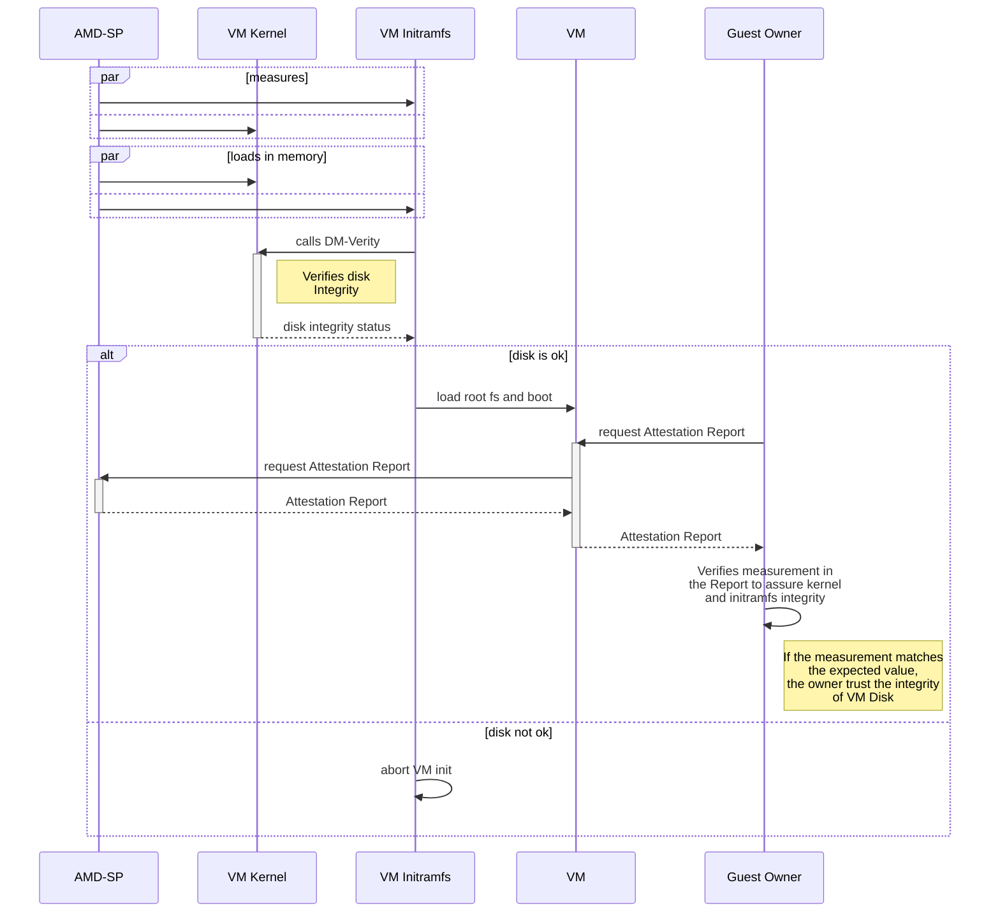
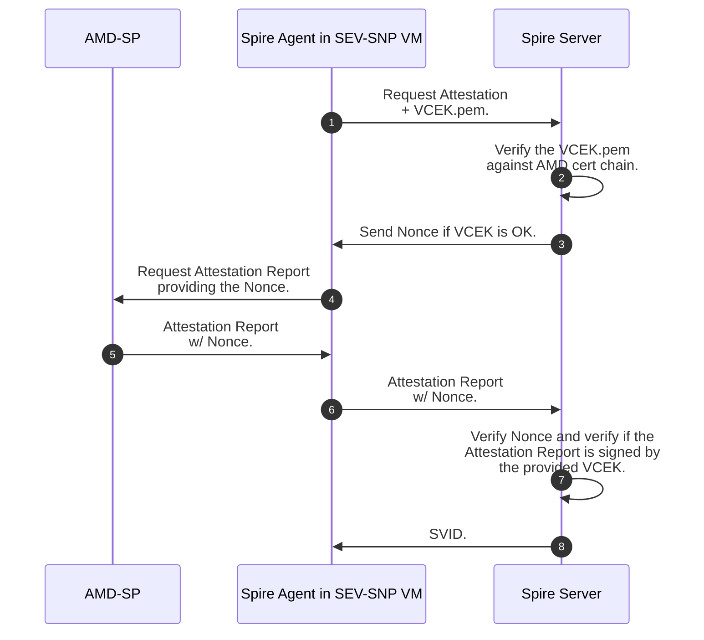

# RFC - SEV SNP Node Attestation Plugin

## Abstract
This document defines the AMD Secure Encrypted Virtualization-Secure Nested Paging (SEV-SNP) Node Attestation Plugin for SPIRE. The plugin provides a mechanism for verifying the identity of SEV-SNP-enabled virtual machines (VMs) by leveraging the hardware-based attestation capabilities of the AMD SEV-SNP processor. The document provides detailed specifications for the plugin, including its workflow, threat model, and description of its chain of trust. It also describes the security considerations and deployment scenarios for the plugin.

## Background
### AMD SEV-SNP
AMD SEV-SNP (Secure Encrypted Virtualization-Scalable Nested Paging) is a set of hardware-based security features designed to enhance the security of virtualized environments [[4](https://www.amd.com/system/files/TechDocs/SEV-SNP-strengthening-vm-isolation-with-integrity-protection-and-more.pdf)]. It extends both the AMD Secure Encrypted Virtualization (SEV) technology, which provides hardware-based memory encryption for VMs to isolate them from the hypervisor [[1](https://developer.amd.com/sev/)], and SEV-Encrypted State (SEV-ES), which adds additional protection for CPU register state as an extension of SEV [[3](https://www.amd.com/system/files/TechDocs/Protecting%20VM%20Register%20State%20with%20SEV-ES.pdf)].

The main difference between AMD SEV/SEV-ES and AMD SEV-SNP is the strong memory integrity protection that helps preventing malicious hypervisor-based attacks, such as data replay and memory re-mapping. The fundamental concept behind SEV-SNP integrity is that whenever a VM accesses an encrypted page of memory, it must retrieve the value it previously wrote. If it reads a different value, an exception must be thrown [[4](https://www.amd.com/system/files/TechDocs/SEV-SNP-strengthening-vm-isolation-with-integrity-protection-and-more.pdf)].

### Threat Model for AMD SEV-SNP Confidential VMs
The threat model for Confidential Computing assumes a highly powerful attacker with privileges to access and manipulate all software layers of the infrastructure, including the operating systems, hypervisors, and cloud computing platforms where confidential workloads are running. The attacker may have the ability to steal cryptographic keys and sensitive data, modify application code or binaries, and launch various types of attacks, such as side-channel attacks. [[4](https://www.amd.com/system/files/TechDocs/SEV-SNP-strengthening-vm-isolation-with-integrity-protection-and-more.pdf)]

Under SEV-SNP, as with SEV and SEV-ES, the AMD System-On-Chip (SoC) hardware, the AMD Secure Processor (AMD-SP), and the VM itself are all treated as fully trusted, while all other CPU software components, PCI devices, and operators of these are treated as fully untrusted. This includes the BIOS on the host system, the hypervisor, device drivers, and other VMs. This means that these components are assumed to be malicious, potentially conspiring with other untrusted components in an effort to compromise the security guarantees of an SEV-SNP VM. 


[[4](https://www.amd.com/system/files/TechDocs/SEV-SNP-strengthening-vm-isolation-with-integrity-protection-and-more.pdf)]

Since the SEV-SNP considers the guest VM as completely trusted, it does not make any effort to protect the VM from itself. To enable third parties to have confidence in the VM's state, the SEV-SNP provides a mechanism to attest the VM's integrity. This is done by generating an Attestation Report that reflects the VM's context, including policy information and measurements taken by the AMD-SP during launch. Through these Attestation Reports, third parties are able to verify, for example, if the VM has been launched with a specific version of Linux Kernel, or if some Disk Integrity mechanism has been configured in the Initramfs, or even if this VM is allowed to run in debug mode. This Attestation Reports are described in the next topic.

### Chain of Trust
To build a chain of trust between the AMD-SP and the guest VM that can be validated by remote parties, the AMD-SP provides a protected path through which the guest VM can request Attestation Reports on their behalf at any time. When the guest asks for a report, it supplies 512 bits of arbitrary data to be included in the report. The resulting report will contain this data alongside with identity information about the guest and the host where it is running. The report is signed by the Versioned Chip Endorsement Key (VCEK), an attestation signing key derived from chip-unique secrets and a TCB (Trusted Computing Base) version, signed by the AMD Root Keys and kept inside the AMD-SP with no access by users. The third party should verify the authenticity of the report based on its signature. A successful signature verification proves that the 512 bits of guest data supplied in the report came from the guest whose identity is described.

**Attestation Report**

The purpose of the Attestation Report is to allow the VM to prove to third parties that it is a confidential VM, and it has been configured in a trustable state, with no tampering. The following table describes the Attestation Report structure (notice that we have highlighted the fields that we intent to use as selectors for the attestation plugin):

| Name              | Description                                                                                                                          |
|-------------------|--------------------------------------------------------------------------------------------------------------------------------------|
| `POLICY`          | `The guest policy.`                                                                                                                  |
| `MEASUREMENT`     | `The measurement calculated at launch.`                                                                                              |
| REPORT_DATA       | Guest-provided data.                                                                                                                 |
| VERSION           | Version number of the Attestation Report. Set to 0x02 for [this](https://www.amd.com/system/files/TechDocs/56860.pdf) specification. |
| GUEST_SVN         | The guest Secure Version Number (SVN).                                                                                               |
| FAMILY_ID         | The family ID provided at launch.                                                                                                    |
| IMAGE_ID          | The image ID provided at launch.                                                                                                     |
| VMPL              | The request Virtual Machine Privilege Level (VMPL) for the Attestation Report.                                                       |
| SIGNATURE_ALGO    | The signature algorithm used to sign the report. See Chapter 10 for encodings.                                                       |
| CURRENT_TCB       | Current TCB.                                                                                                                         |
| PLATFORM_INFO     | Information about the platform (Indicates if TSME or SMT are enabled in the system).                                                 |
| SIGNING_KEY       | Encodes the key used to sign the report. 0: VCEK. 1: VLEK. 2–6: Reserved. 7: None.                                                   |
| MASK_CHIP_KEY     | The value of MaskChipKey.                                                                                                            |
| AUTHOR_KEY_EN     | Indicates that the digest of the author key is present in AUTHOR_KEY_DIGEST. Set to the value of GCTX.AuthorKeyEn.                   |
| HOST_DATA         | Data provided by the hypervisor at launch.                                                                                           |
| ID_KEY_DIGEST     | SHA-384 digest of the ID public key that signed the ID block provided in SNP_LAUNCH_FINISH.                                          |
| AUTHOR_KEY_DIGEST | SHA-384 digest of the Author public key that certified the ID key, if provided in SNP_LAUNCH_FINISH. Zeroes if AUTHOR_KEY_EN is 1.   |
| REPORT_ID         | Report ID of the guest.                                                                                                              |
| REPORT_ID_MA      | Report ID of the guest’s migration agent.                                                                                            |
| REPORTED_TCB      | Reported TCB version used to derive the VCEK that signed this report.                                                                |
| CHIP_ID           | If MaskChipId is set to 0, Identifier unique to the chip as output by GET_ID. Otherwise, set to 0.                                   |
| COMMITTED_TCB     | Committed TCB.                                                                                                                       |
| CURRENT_BUILD     | The build number of CurrentVersion.                                                                                                  |
| CURRENT_MINOR     | The minor number of CurrentVersion.                                                                                                  |
| CURRENT_MAJOR     | The major number of CurrentVersion.                                                                                                  |
| COMMITTED_BUILD   | The build number of CommittedVersion.                                                                                                |
| COMMITTED_MINOR   | The minor version of CommittedVersion.                                                                                               |
| COMMITTED_MAJOR   | The major version of CommittedVersion.                                                                                               |
| LAUNCH_TCB        | The Current TCB at the time the guest was launched or imported.                                                                      |
| SIGNATURE         | Signature of bytes 0x000 to 0x29F inclusive of this report.                                                                          |
[[5](https://www.amd.com/system/files/TechDocs/56860.pdf)]

The Attestation Report is signed by the private key of the VCEK, which is located inside the AMD-SP. The public key of the VCEK can be used to verify the signature and its authenticity can be verified against the AMD Cert Chain to ensure that it is valid. Therefore, we can guarantee that the report was generated inside an AMD-SP, as it is the only entity that has access to the VCEK private key.

Moreover, the user can include 512 bits of data in the Attestation Report, which ensures its freshness. By doing this, we can trust that the Attestation Reports given by a VM are authentic and have been generated by an authentic AMD-SP due to its signature. Additionally, the user-provided data included in the report allows us to verify that it is not a pre-generated report but rather a fresh one.

**Policy**

The policy parameters refer to the set of rules that governs the behavior of the VM, for example, if the VM allows or not debug mode, or if it is allowed to run in a platform with Simultaneous Multithreading (SMT) enabled or not. In the Attestation Report, the policy field is represented as 64 bits of data and is structured as:

| Bit(s) | Name            | Description                                                                                             |
|--------|-----------------|---------------------------------------------------------------------------------------------------------|
| 63:21  |        -        | Reserved. Must Be Zero.                                                                                 |
| 20     | `SINGLE_SOCKET` | 0: Guest can be activated on multiple sockets / 1: Guest can be activated only on one socket.           |
| 19     | `DEBUG`         | 0: Debugging is disallowed / 1: Debugging is allowed.                                                   |
| 18     | `MIGRATE_MA`    | 0: Association with a migration agent is disallowed / 1: Association with a migration agent is allowed. |
| 17     |        -        | Reserved. Must Be Zero.                                                                                 |
| 16     | `SMT`           | 0: SMT is disallowed / 1: SMT is allowed.                                                               |
| 15:8   | `ABI_MAJOR`     | The minimum ABI major version required for this guest to run.                                           |
| 7:0    | `ABI_MINOR`     | The minimum ABI minor version required for this guest to run.                                           |
[[5](https://www.amd.com/system/files/TechDocs/56860.pdf)]

**Launch Measurement**

The Attestation Report also contains a Launch Measurement of the guest, which is calculated as [[6](https://www.amd.com/system/files/TechDocs/56860.pdf)] [[7](https://www.qemu.org/docs/master/system/i386/amd-memory-encryption.html)]:

```
HMAC(0x04 || API_MAJOR || API_MINOR || BUILD || GCTX.POLICY || GCTX.LD || MNONCE; GCTX.TIK)
```

Where "||" represents concatenation. The GCTX.LD is a hash digest of all plaintext data imported into the guest, and it can be calculated as:

```
SHA256(firmware_blob || kernel_hashes_blob || vmsas_blob)
```

Where:
* `firmware_blob` is the content of the entire firmware flash file (for example, OVMF.fd). Note that you must build a stateless firmware file which doesn’t use an NVRAM store, because the NVRAM area is not measured, and therefore it is not secure to use a firmware which uses state from an NVRAM store.

* If kernel is used, and _kernel-hashes=on_, then `kernel_hashes_blob` is the content of PaddedSevHashTable (including the zero padding), which itself includes the hashes of kernel, initrd, and cmdline that are passed to the guest. The PaddedSevHashTable struct is defined in target/i386/sev.c.

* If SEV-ES is enabled (_policy & 0x4 != 0_), `vmsas_blob` is the concatenation of all VMSAs of the guest vcpus. Each VMSA is 4096 bytes long; its content is defined inside Linux kernel code as struct vmcb_save_area, or in AMD APM Volume 2 ([APMVOL2](https://www.amd.com/system/files/TechDocs/24593.pdf)) Table B-2: VMCB Layout, State Save Area.

## Assuring Node Integrity and Security
Although SEV-SNP guarantees memory encryption for guests, it only encrypts data in use. To ensure the protection of data at rest, such as keys and secrets stored in the VM disk, a Full Disk Encryption (FDE) solution such as Linux Unified Key Setup (LUKS) must be used. To guarantee the integrity of data at rest, an integrity verification tool such as DM-Verity must also be used. It is recommended to include these verifications in the initramfs and/or kernel because they are measured in the Launch Measurement included in the Attestation Report so you can verify if the value matches with the expected, ensuring that everything has been performed correctly and that there has been no tampering in the kernel neither in initramfs.

The sequence diagram presented next describes how a chain of trust between AMD-SP and the VM disk integrity is built through the Launch Measurement included in the Attestation Report. Although other components impact the chain of trust, in this scheme, we focus in the ones that impact directly in the integrity of the VM Disk.



1. In the first step, the AMD-SP measures the Kernel and the Initramfs;
2. After mesured, the Kernel and the Initramfs are loaded in the memory of the VM;
3. When the Initramfs run, it calls the module DM-Verity of the Kernel to verify the disk integrity;
4. If the verification passes and VM disk is ok, the VM starts, if not, the VM does not start;
5. After the VM is running, the Guest Owner can request for Attestation Reports, wich contains the measurement generated in the step 1, that includes hashes of Initramfs and Kernel;
6. After receiving the Attestation Report, the Guest Owner can verify if the measurement matches with the expected value. If it matches, then the Guest Owner can trust the verification made by Initramfs using the Kernel's DM-Verity module;

## Proposal
We propose a new SPIRE Node Attestation Plugin that uses SEV-SNP features to attest SPIRE Agents running inside SEV-SNP enabled VMs. The idea behind the plugin is to take advantage of the existing Attestation Report provided by the AMD-SP to guarantee the identity and integrity of the VM that is running the SPIRE Agent.

### Attestation Workflow


1. In the first step, the SPIRE Agent running inside the SEV-SNP Guest sends an attestation request along with the VCEK public certificate.
2. The Server then verifies if the VCEK is valid by checking it against the AMD cert chain.
3. If the VCEK is valid, the Server sends a nonce to the Agent to be included in the Attestation Report.
4. The Agent then requests an Attestation Report from the AMD-SP, providing the nonce sent by the Server.
5. The AMD-SP generates an Attestation Report with the nonce included and sends it to the Agent.
6. The Agent sends the Attestation Report to the Server.
7. The Server verifies if the nonce included in the Attestation Report is correct and verifies if the Report was signed by the private part of the VCEK.
8. If the validations in step 7 are successful, the SVID is provided to the Agent.

### Configuration
To run the plugin, the Agent must be provided with the public part of the VCEK, which can be obtained through requests made to the AMD-SP.


| Configuration | Description                 |
|---------------|-----------------------------|
| `vcek_path`   | The path to the VCEK cert.  |

A sample configuration for the SPIRE Agent running inside the SEV-SNP VM with the VCEK.pem file located at `/home/ubuntu` would include the following configs for Node Attestor:

```conf
    # agent.conf
    NodeAttestor "sev_snp" {
        plugin_data {
	        vcek_path = "/home/ubuntu/vcek.pem"
        }
    }
```

The server must then be provided with the AMD cert chain so that it can verify the authenticity of the VCEK. The steps to obtain this cert chain can be found [here](https://www.amd.com/system/files/TechDocs/57230.pdf).

| Configuration      | Description                      |
|--------------------|----------------------------------|
| `amd_cert_chain`   | The path to the AMD Cert Chain.  |

A sample configuration for the SPIRE Server to attest Agents running inside SEV-SNP VMs, with the AMD Cert Chain file located at `/home/ubuntu`, would include the following configs for Node Attestor:

```conf
    # server.conf
    NodeAttestor "sev_snp" {
	    plugin_data {
	        amd_cert_chain = "/home/ubuntu/cert_chain.pem"
	    }
    }
```
### Selectors

About the selectors for the plugin, we propose using:


| Selector                       | Description                                                                                                     |
|--------------------------------|-----------------------------------------------------------------------------------------------------------------|
| `sev_snp:vcek`                 | SHA512 of the VCEK.pem file                                                                                     |
| `sev_snp:measurement`          | The Guest Measurement generated by AMD-SP at launch                                                              |
| `sev_snp:policy:single_socket` | true: Guest can be activated only on one socket. <br/> false: Guest can be activated on multiple sockets.           |
| `sev_snp:policy:debug`         | false: Debugging is disallowed. <br/> true: Debugging is allowed.                                                   |
| `sev_snp:policy:migrate_ma`    | false: Association with a migration agent is disallowed. <br/> true: Association with a migration agent is allowed. |
| `sev_snp:policy:smt`           | false: SMT is disallowed. <br/> true: SMT is allowed.                                                               |
| `sev_snp:policy:abi_major`     | The minimum ABI major version required for the guest to run.                                                    |
| `sev_snp:policy:abi_minor`     | The minimum ABI minor version required for the guest to run.                                                    |

### SPIFFE ID Format

Finally, the proposed SPIFFEID structure for the plugin looks like:

```
spiffe://<trust-domain>/spire/agent/sev_snp/<uuid>/measurement/<measurement_selector_value>/policy/<hex_number_representing_the_ _64_bits_of_the_guest_policy>
```

Example: 
```
spiffe://lsd.ufcg.edu.br/spire/agent/sev_snp/48e6d61a-d09a-4506-aee0-a3c24f8a28cb/measurement/d4f53ef416e0daa9a19459b9c97b3371e1454e5c/policy/0x30000
```

## Request for Comments

This proposal seeks to elicit feedback on the proposed approach for an AMD SEV-SNP Node Attestation Plugin and which selectors shoud be used. The plugin aims to enhance the security of virtualized environments by verifying the identity of SEV-SNP-enabled VMs through leveraging the hardware-based attestation capabilities of the AMD SEV-SNP processor. We welcome any comments, suggestions, or concerns you may have about the proposal.

Authors:

- Davi Pontes, [Distributed Systems Lab at Federal University of Campina Grande](lsd.ufcg.edu.br)
- Fernando Silva, [Distributed Systems Lab at Federal University of Campina Grande](lsd.ufcg.edu.br)
- Eduardo Falcão, [Federal University of Rio Grande do Norte](https://www.ufrn.br/)
- Andrey Brito, [Distributed Systems Lab at Federal University of Campina Grande](lsd.ufcg.edu.br)

## References

- [1] AMD Secure Encrypted Virtualization (SEV) https://developer.amd.com/sev/

- [2] AMD MEMORY ENCRYPTION https://amd.wpenginepowered.com/wordpress/media/2013/12/AMD_Memory_Encryption_Whitepaper_v9-Public.pdf

- [3] PROTECTING VM REGISTER STATE WITH SEV-ES https://www.amd.com/system/files/TechDocs/Protecting%20VM%20Register%20State%20with%20SEV-ES.pdf

- [4] AMD SEV-SNP: Strengthening VM Isolation with Integrity Protection and More https://www.amd.com/system/files/TechDocs/SEV-SNP-strengthening-vm-isolation-with-integrity-protection-and-more.pdf

- [5] SEV Secure Nested Paging Firmware ABI Specification https://www.amd.com/system/files/TechDocs/56860.pdf

- [6] Secure Encrypted Virtualization API Version 0.24 https://www.amd.com/system/files/TechDocs/56860.pdf

- [7] QEMU AMD Secure Encrypted Virtualization (SEV) https://www.qemu.org/docs/master/system/i386/amd-memory-encryption.html
