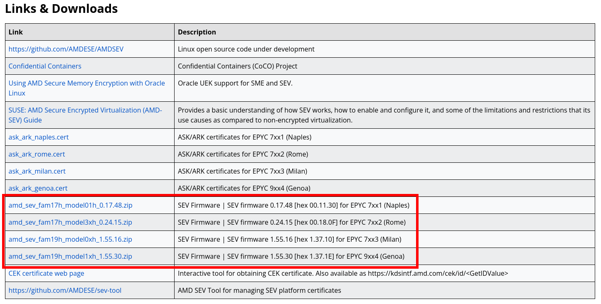
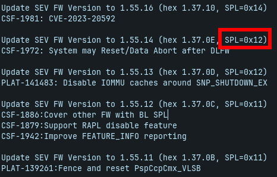

# FAQ

Here, we want to present some problems you may face while running the plugin on differents environments.

## Sumary:

[1 - Issue in obtaining the SNP report?](#1---issue-in-obtaining-the-snp-report)

[2 - Why can't the plugin fetch the EK on some public clouds?](#2---why-cant-the-plugin-fetch-the-ek-on-some-public-clouds)

[3 - Why does the cert chain check fail against my VCEK/VLEK?](#3---why-the-cert-chain-check-fails-against-my-vcekvlek)

[4 - How can I set the min_fw_version on server conf?](#4---how-can-i-set-the-min_fw_version-on-server-conf)

[5 - How to pre-compute the launch measurement using the sev-snp-measure tool?](#5---how-to-pre-compute-the-launch-measurement-using-the-sev-snp-measure-tool)

## Questions:

#### 1 - Issue in obtaining the SNP report?

Our plugin needs to have access to the device to be able to attest the node. If you are using the SVSM approach, you need to be sure that the Agent has access to the `/dev/tpm0` device. Otherwise, when running in a non-SVSM CVM, i.e., in CVMs with access to the `/dev/sev-guest` device, be sure the Agent has access to the sev-guest device. If you run a K8S cluster over CVMs, notice that these hints are implemented by exposing the device (TPM or SNP) to the pod.

The error will appear as "panic: runtime error", and may be rose from the ```snputil.GetReportTPM()``` ou ```client.GetRawExtendedReport(device, nonce)``` functions.

#### 2 - Why can't the plugin fetch the EK on some public clouds?
    
Some CVM instances do not load the EK in the AMD-SP cache in a non-deterministic fashion. In that case, you need to provide the EK through the SPIRE Agent configuration file on the `ek_path` field.

#### 3 - Why does the cert chain check fail against my VCEK/VLEK?

You need to be sure that your machine has a VCEK or VLEK. It is possible to get machines with different EK types on the same cloud provider, so you must check if you need to load a VCEK or a VLEK on the plugin configuration.

#### 4 - How can I set the min_fw_version on server conf?

The `min_fw_version` config on the server side defines which firmware version your server will consider updated. For instance, if you set it to `0x14`, every agent running on a node with firmware version greater than or equal to `0x14` will receive the selector `amd_sev_snp:fw_version:updated`. Otherwise, it will not receive any value.

To know which version to configure, you can go to [AMD's website](https://www.amd.com/pt/developer/sev.html), search for `Links & Downloads` section, and download the `SEV Firmware` correspondent to your EPYC processor (Milan | Rome | Genoa | Naples).



After downloading it, you can extract the files and open the `<VERSION> Release Notes.txt` file. It will contain the release notes of the processor firmware. There you can see the versions and related security issues. To set the selector, you must use the `SPL` value of the firmware version.



#### 5 - How to pre-compute the launch measurement using the *sev-snp-measure* tool?

Using the [*sev-snp-measure*](https://github.com/virtee/sev-snp-measure.git), you can pre-calculate the launch measurement using the parameters like the *kernel, initrd, OVMF_CODE*, and information about the SEV-SNP virtual machine.

It is a Python tool that can be obtained as follows:
```bash
git clone https://github.com/virtee/sev-snp-measure.git

cd sev-snp-measure

python ./sev-snp-measure.py #args
```

There are some details when computing the launch measurement for CVMs in different environments.

For instance, for on-premise non-SVSM CVMs, you should execute the sev snp measure tool as follows:
```bash
python ./sev-snp-measure.py --mode snp --vcpus=<NUMBER_OF_CPUS> --vcpu-type=EPYC-v4 --ovmf=<OVMF_CODE_PATH> --kernel=<KERNEL_PATH> --initrd=<INITRD_PATH> --append=<KERNEL_CMD_LINE> --guest-features=0x1
```

Notice that if you are using an SNP Kernel older than 6.6 you need to keep using the flag --guest-feature=0x1, else you need to change the value to --guest-feature=0x21.

For on-premise SVSM CVMs, you should execute the sev snp measure tool as follows:

```bash
#TODO
```

For AWS CVMs, you should first download the latest ovmf_img.fd from its [repo release notes](https://github.com/aws/uefi/releases).
Then, execute the sev snp measure tool as follows:

```bash
python ./sev-snp-measure.py --mode snp --vcpus=<NUMBER_OF_CPUS> --vcpu-type=EPYC-v4 --vmm-type=ec2 --ovmf=<OVMF_CODE_PATH> --guest-features=0x1
```

Notice that only the firmware impacts the launch measurement of AWS SNP CVMs. Kernel and initrd have no impact on such a value.