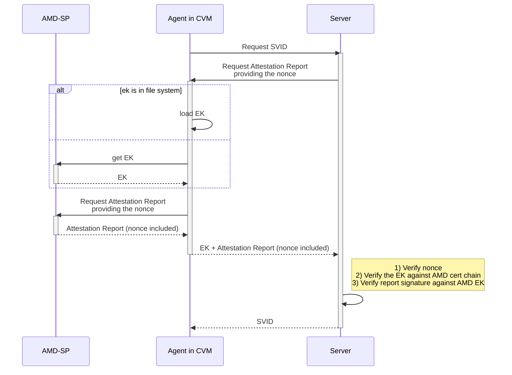
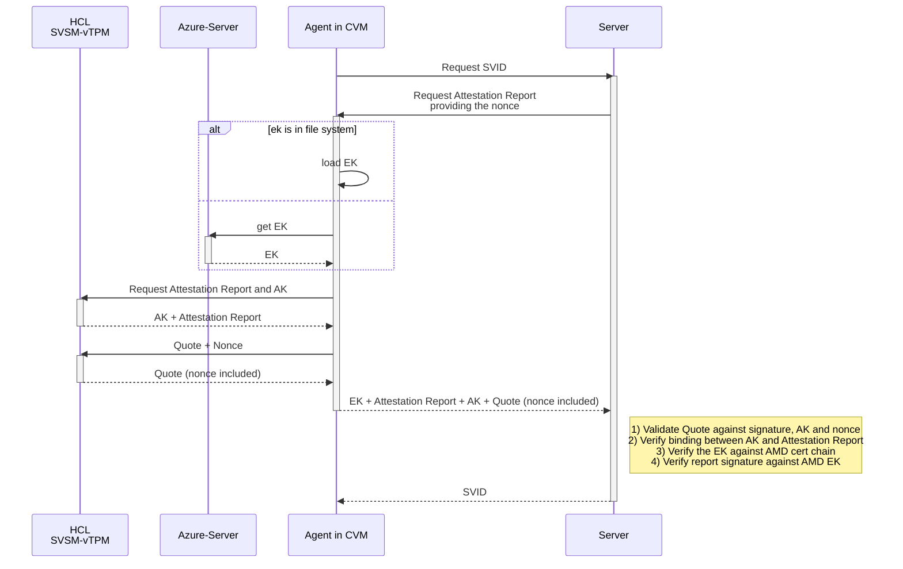
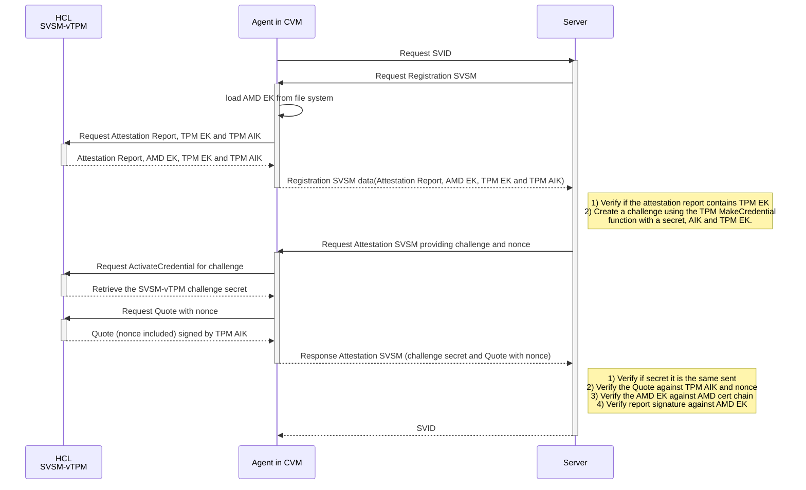

# Attestation Workflow

The main idea of the AMD SEV-SNP Node Attestation plugin is relying on information provided on the Attestation Report supplied by the AMD-SP to issue the SVID of the Agent.

The overall plugin workflow can be described in the following steps:

1. The Server receives an attestation request from the Agent. 
2. The Server requests an Attestation Report and the EK (VCEK/VLEK) to the Agent, providing a nonce.
3. The Agent obtains the EK, and the Attestation Report. The nonce will be used for freshness purposes.
4. The Server receives the EK and the Attestation Report. It verifies: i) if the EK was generated from AMD root keys; ii) if the Attestation Report was signed with the provided EK; iii) if the nonce returned is correct. If these verifications succeed, the Server issues an SVID to the Agent.

Notice, however, that this workflow may be slightly different depending on which environment the SEV-SNP VM is running. Actually, what differs is the strategy to obtain and validate the attestation report.

1. Sev-guest device: on-premise, AWS, GCP
2. vTPM provided through SVSM for Azure 
3. vTPM provided through SVSM for on-premise (WIP)

To sum up, the AMD SEV-SNP plugin works in 5 configurations: 1) On-premise without support to SVSM; 2) On-premise with support to SVSM; 3) AWS; 4) Azure; 5) GCP.
For details on configuring the Agent to run the plugin in cloud providers, refer to [this documentation](cloud-providers.md).

The three strategies to obtain and validate the Attestation Report are detailed next in the context of the overall attestation workflow.

## Sev-guest device (on-premise, AWS, GCP)

## vTPM provided through SVSM for Azure 

***HCL is the VPML 0 in the Azure architecture, where vTPM is located***

## vTPM provided through SVSM for on-premise

