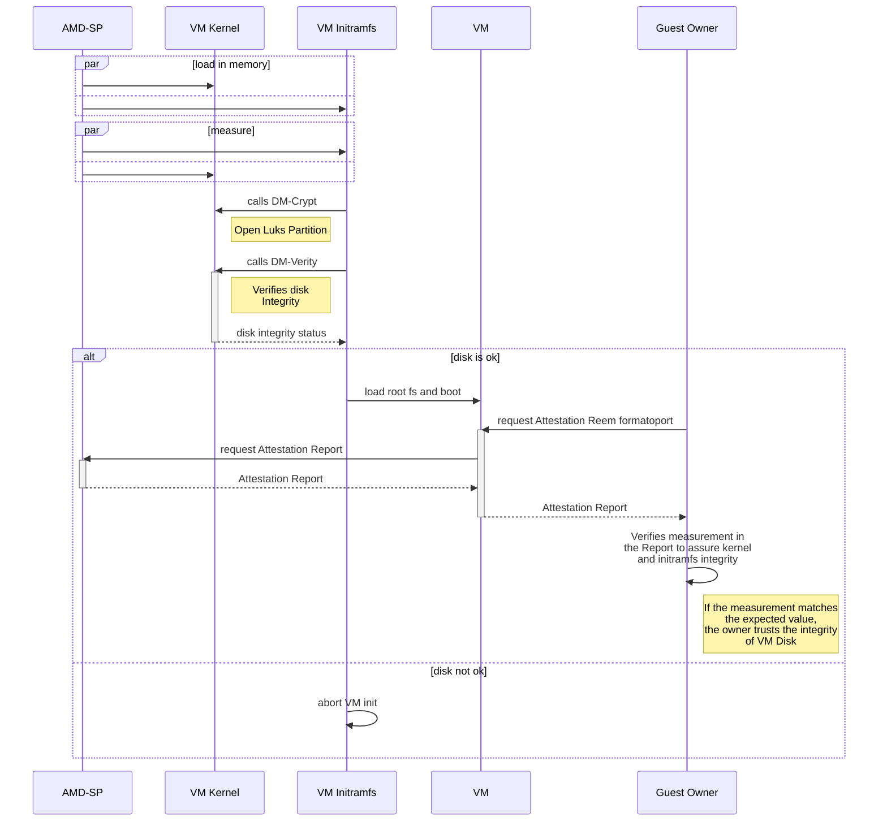
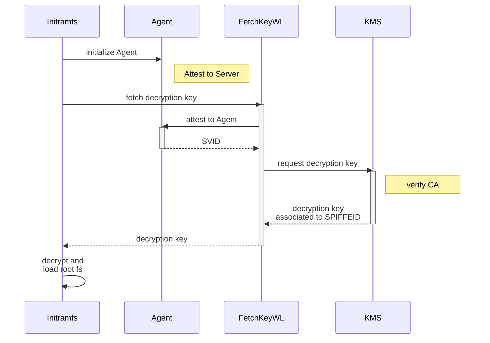

# Ensuring Disk Integrity and Confidentiality

Although SEV-SNP guarantees guest memory encryption, it only encrypts data in use. To ensure data protection at rest, such as keys and secrets stored in the VM disk, a Full Disk Encryption (FDE) solution, such as Linux Unified Key Setup (LUKS), must be used. To guarantee data integrity at rest, an integrity verification tool such as DM-Verity must also be used. It is recommended to include these verifications in the Initramfs or kernel because they are measured in the Launch Measurement included in the Attestation Report so the VM owner can verify if the value matches with the expected, ensuring that everything has been performed correctly and that there has been no tampering neither in the kernel nor in Initramfs.

The sequence diagram presented next describes how a chain of trust between AMD-SP and the VM disk integrity is built through the Launch Measurement included in the Attestation Report. Although other components impact the chain of trust, in this scheme, we focus on the ones that directly affect the integrity of the VM Disk.

1. The kernel and the Initramfs are loaded in the memory of the VM.
2. The AMD-SP measures the kernel and the Initramfs.
3. When the Initramfs runs, it calls the module DM-Crypt of the kernel to open the encrypted partition.
4. The Initramfs calls DM-Verity kernel module to verify the disk integrity.
5. If the verification passes and the VM disk is ok, the VM starts; if not, the VM start halts.
6. After the VM is running, the Guest Owner can request Attestation Reports containing the measurement generated in step 1, which considers hashes of Initramfs and kernel.
7. After receiving the Attestation Report, the Guest Owner can verify if the measurement matches the expected value. If it matches, then the Guest Owner can trust the verification made by Initramfs using the kernel's DM-Verity module.

For step 3, we must retrieve the secret to open the encrypted partition. For this, we can use a Key Managment Service (KMS). For the proof of concept, we used a workload named Fetch Key Workload (FetchKeyWL) to retrieve the secret (the disk encryption key) based on the SPIFFE ID and the disk UUID.

